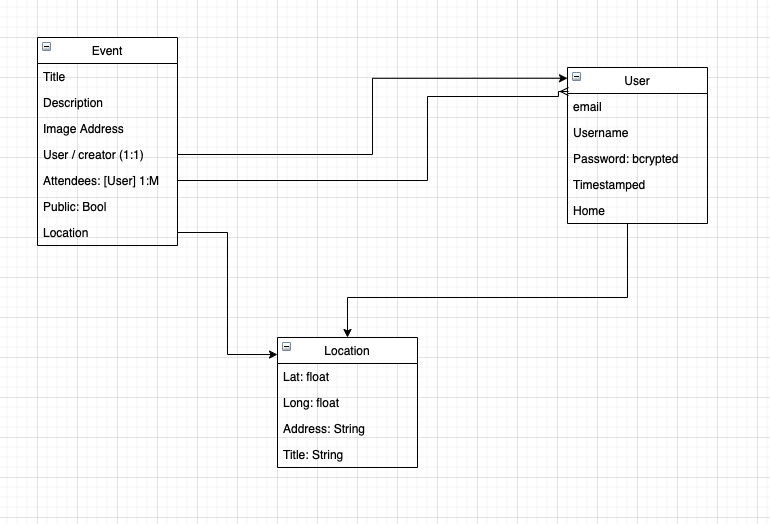

# Peer-nem
General Assembly capstone project - NEM stack Event Management application designed to connect people to places.

## User Stories:
Upon going to the website, a user is greeted with a splash page showing what Peer is about. The user then creates an account, supplying their name, password, username, avatar, & email. The user is then directed to their profile page showing a list of their registered events or a list of peers they friended. A user can go to a list screen of public events near their area  (within 25mi, 50mi, 100mi). A user can also look at private events they have been invited to. When a user creates an event, they specify the Name, Date, Location, Description, event image, and who is invited. 
A user should be able to click on an event to view the event screen displaying all the relevant information. 

Pages -
Splash -
Has navbar with options to login/signup. Upon click of the login/sign up, a form will slide over the page to the center from the side. (use CSS to change position and animate).
A carousel showing images that have to do with the app that auto scrolls along with image choice buttons
Some description content about the application

Profile -
Navbar with a logout button and a home button
A list of events they are invited to
A list of events they currently have planned
[Their friends]

Main -
A list of current public events in their area
A list of current private events they have planned or are invited to
[A map of their current surroundings with pins for each private event]

Event Show -
The title, description, date, event creator/admin, a map showing the location of the event (coordinates), and an image of the event.
If the user accessing this page is the user who created the event, display alternate options for updating or deleting the information.

Event Create -
A large form asking for the event name, description, location (address), date, image, [and people going].

Event Update -
Like the event create page, accept all information about the event is already filled into the screen

Technologies - 
NEM Stack; Node.js, Express.js, MongoDB, and EJS for views templating. 

Reaches -
Use AWS to store the images of events and people
Use the google maps API to convert the event address into geolocation, so you can display a map on the event view page
Have the option to display a map instead of the event list with pins at all the event locations. Upon hover, see a small description of the event. 

## Development Plan:
---Phase 1: Server & app configuration
Set up npm project: npm init
Install dependencies: express, mongoose, ejs, bcrypt, dotenv, express-session, method-override, connect-mongo
Set up the server outline, external modules, internal modules, instanced modules, app configuration, middleware (docstring’d), connect controllers to routes, server bind
Test app in browser
Set up the rest of the folder structure; config, controllers, models, public, sass, views

--Phase 2: Set up models / users EX
Create a db.connection.js file inside the config folder and connect to mongo through mongoose there. Dont forget to set up the .env file if you havent yet.
Create an index file inside the models; this is where we will connect to the mongoose connection through require and module.exports an object containing all the references to the models we have created. 
Create a User.js file in the models folder, this will house the user schema for our app. 
Connect to mongoose, create a new mongoose.Schema, create a model from the schema, export the model.
Import the model inside the index file for use inside our app.
Retrace steps 3-5 with other schemas you need to create. 

	Other models: {Events}

--Phase 3: Create the controller / users EX(contd…)
Create an index file where you will export the different controllers you have created as an object.
Create The auth controller, require express, router = express.Router(), bcrypt, and the user model.
Routes: GET /splash, POST /register, POST /login, GET /logout
Use try{}catch{} to handle errors inside the callback functions async/await
Export the router
Import inside the index for export to server

--Phase 4: Create the views
Use ejs to create the body related partials. 
Inside the header partial, add the connecting to the google maps api that will be used inside the event show page. 

--Phase 5: Stretch goals
Create filtering by distance from user on the main page.
Create a map view to show all the events as markers on the global map

## ERM:
